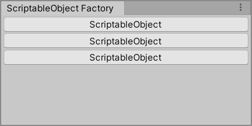

# ScriptableObject Factory Window

The `ScriptableObject Factory Window` is an editor window for creating ScriptableObjects in Unity. It provides a convenient interface within the Unity Editor for creating instances of ScriptableObjects and saving them as assets.

## Usage

To use the `ScriptableObject Factory Window`, follow these steps:

1. Open the Unity Editor.
2. In the Unity Editor menu, navigate to "Tools" and select "ScriptableObject Factory".
3. The `ScriptableObject Factory Window` will open, displaying a list of available ScriptableObject types.
4. Click on the desired ScriptableObject type to create an instance of it.
5. The created ScriptableObject instance will be saved as an asset in the project.

## Customization

The `ScriptableObject Factory Window` can be customized according to your needs. Here are some options for customization:

- Add or remove ScriptableObject types: Open the `ScriptableObjectFactoryWindow.cs` script and modify the `m_ScriptableObjectTypes` array to include the desired ScriptableObject types.
- Modify the window title: Open the `ScriptableObjectFactoryWindow.cs` script and change the value of the `WINDOW_NAME` constant to set a different window title.

## Notes

- If you find the `ScriptableObject Factory Window` helpful, please consider giving it a star on the GitHub repository. Your support is greatly appreciated!

## License

The `ScriptableObject Factory Window` is provided as-is under the terms of the MIT License. Feel free to modify and adapt it to suit your needs.
